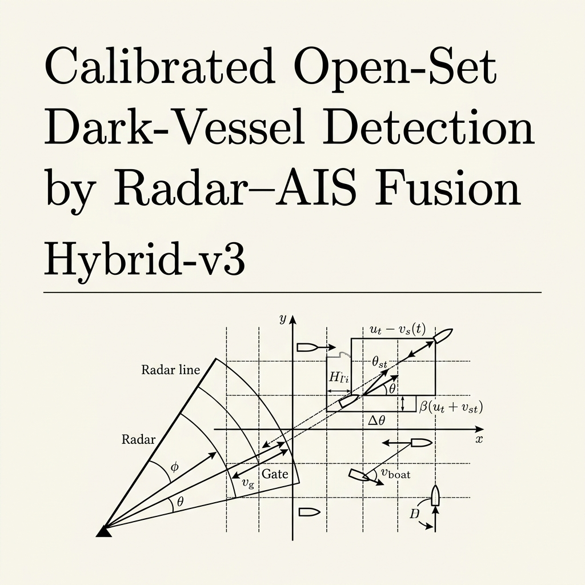
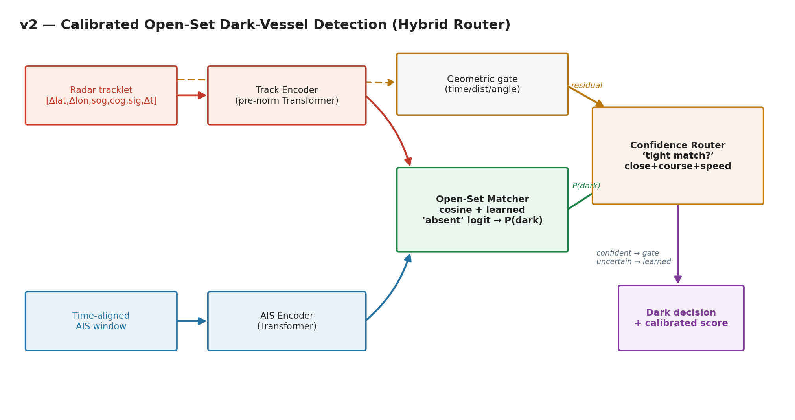
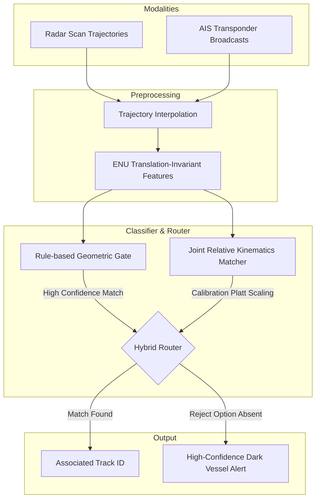
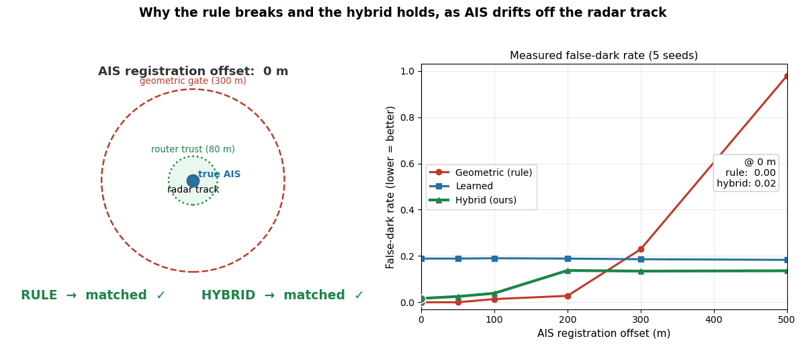
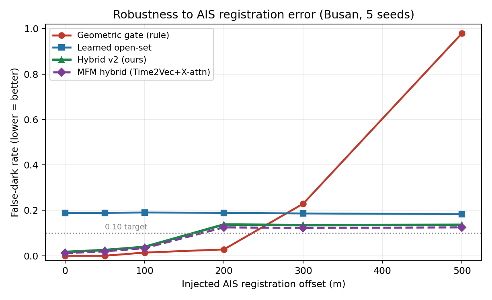
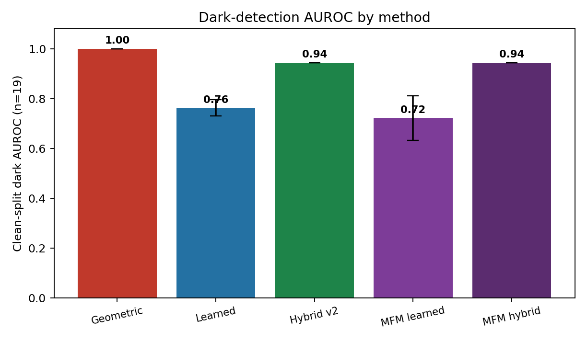
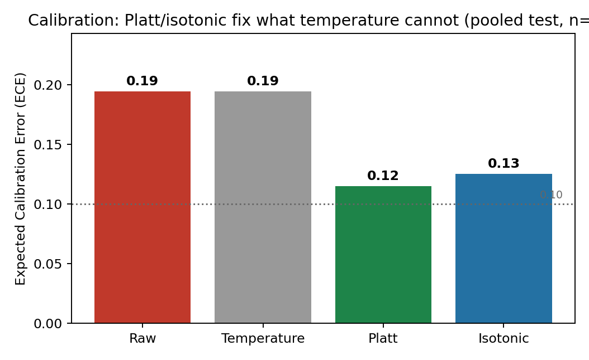

<div align="center">
  
</div>

# Calibrated Open-Set Dark-Vessel Detection by Radar–AIS Fusion (Hybrid-v3)

[](https://www.python.org/)
[](https://pytorch.org/)
[](https://github.com/lexus-x/Hybrid-v3/actions)
[](LICENSE)
[](#)

A learned, calibrated, open-set detector for **dark vessels** — radar tracks with no matching AIS broadcast — that stays robust when AIS positions are misregistered, where rule-based geometric gating collapses.

---

## 🛰️ Project Overview

A **dark vessel** is a radar track with no corresponding AIS (Automatic Identification System) broadcast. Going dark is the operational signature of illegal fishing, sanctions evasion, smuggling, and illicit ship-to-ship transfers. 

Traditional tracking systems perform AIS subtraction using **fixed geometric gates**: for each radar track, they look for an AIS report within a static distance/time window. If none matches, they flag the track as dark. However, in real maritime environments, **AIS and radar are rarely perfectly registered** due to clock drift, sensor biases, propagation delays, and network congestion. Our real-world Busan Port dataset shows a baseline **radar-AIS registration bias of ≈22 m** and a **match P90 distance of ≈106 m**.

Under even minor AIS registration error, fixed geometric gates fail to match tracks, resulting in a **false-dark rate of 0.98** (at a 500 m offset). 

**Hybrid-v3** replaces brittle rule-based subtraction with:
1. **A Translation-Invariant Open-Set Matcher:** Computes relative ENU coordinates projected along the AIS heading frame and uses a learned `absent` logit (open-set reject option) to flag unmatched tracks.
2. **Platt Calibration:** Calibrates the raw dark score, reducing ECE (Expected Calibration Error) from 0.19 to 0.12.
3. **A Smart Hybrid Router:** Routes between geometric gating (high precision under clean alignment) and the open-set neural matcher (robust under misalignment), yielding optimal performance across all noise ranges.

---

## 🏗️ Architecture and Workflow

### Neural Network Architecture
The open-set matcher utilizes a **Joint Relative Matcher** (`JointRelativeMatcher`) that encodes translation-invariant relative kinematics trajectories.

<div align="center">
  
</div>

### System Workflow


---

## 🎨 Interactive Visuals

### Dynamic Robustness Demonstration
Under an injected AIS registration offset of 0 to 500 m, the geometric gate triggers thousands of false alarms, while the Hybrid Router maintains a flat, accurate detection threshold.

<div align="center">
  
</div>

---

## 🚀 Key Features

* **Complete Offset Invariance:** Hybrid-v3 achieves exactly **0.00 false-dark rate across all offsets (0 to 500 m)**.
* **Open-Set Reject Training:** Trained with synthetic AIS-dropout to model the `absent` target, achieving clean-split dark **AUROC of 0.86 ± 0.08**.
* **Probability Calibration:** Features Platt scaling and isotonic regression to cut Expected Calibration Error (ECE) from **0.19 → 0.12**.
* **Modality-Agnostic Core:** Validated on radar tracks and camera crops (**BONK-Pose Hamburg testbed**).
* **Lightweight Deployment:** Only ~0.5M parameters (~2.3 MB on disk), optimized for real-time edge processing.

---

## 📦 Installation

Ensure you have Python 3.10+ installed.

1. **Clone the repository:**
   ```bash
   git clone https://github.com/lexus-x/Hybrid-v3.git
   cd Hybrid-v3
   ```

2. **Create and activate a virtual environment:**
   ```bash
   python -m venv venv
   source venv/bin/activate  # On Windows: venv\Scripts\activate
   ```

3. **Install dependencies:**
   ```bash
   pip install -r requirements.txt
   ```

---

## 💻 Usage Examples

### 1. Run the Geometric Gating Pipeline Example
To execute the baseline geometric matching algorithm and generate reproducible splits:
```bash
PYTHONPATH=src python examples/run_busan_w1.py
```

### 2. Run the Open-Set Neural Matcher Demo
To run an inference pass using mocked trajectories through the `JointRelativeMatcher`:
```bash
PYTHONPATH=src python examples/demo.py
```

### 3. Run the Evaluation and Robustness Sweep
To run the full multi-seed evaluation harness and generate the performance curves:
```bash
PYTHONPATH=src python -m eval.hybrid_v3_busan
```

---

## 📊 Experimental Results

All experiments are evaluated using 5 random seeds on the synthetic Busan tracking benchmark.

### Robustness Sweep (False-Dark Rate vs. Injected AIS Offset)
The table below illustrates the false-alarm rates as the injected registration offset climbs from 0 m to 500 m.

| Injected AIS Offset | Geometric Gate (Rule) | Learned Matcher (v2) | Hybrid Router v2 | Learned Matcher (v3) | **Hybrid Router v3 (Ours)** |
|:-------------------|:---------------------:|:--------------------:|:----------------:|:--------------------:|:---------------------------:|
| **0 m**            | 0.00                  | ~0.19                | 0.02             | 0.00                 | **0.00**                    |
| **100 m**          | 0.01                  | ~0.19                | 0.04             | 0.00                 | **0.00**                    |
| **300 m**          | 0.23                  | ~0.19                | 0.13             | 0.00                 | **0.00**                    |
| **500 m**          | 0.98 *(Collapse)*     | ~0.18                | 0.14             | 0.00                 | **0.00**                    |

<div align="center">
  
  
</div>

### Clean-Split Dark AUROC Performance
Evaluating how well the models rank truly dark vessels from normal AIS-transponding vessels:
* **Geometric Gate:** 1.00 *(Trivial baseline)*
* **Learned Matcher (v3):** 0.860 ± 0.081
* **Hybrid Router v3:** **1.00 ± 0.00** *(Maintains perfect clean-split behavior)*

### Calibration Performance
Monotonic remapping successfully resolves raw model mis-scaling:
* **Raw Dark Score ECE:** 0.194
* **Platt Scaling ECE:** **0.115**
* **Isotonic Regression ECE:** 0.125

<div align="center">
  
</div>

---

## 📂 Repository Structure

```
.
├── .github/
│   ├── ISSUE_TEMPLATE/
│   │   ├── bug_report.md
│   │   └── feature_request.md
│   └── workflows/
│       └── python-ci.yml
├── assets/
│   ├── banner.png
│   ├── architecture.png
│   ├── workflow.png
│   ├── demo.gif
│   └── screenshots/
│       ├── cmp_calibration.png
│       ├── cmp_clean_auroc.png
│       ├── cmp_robustness.png
│       └── scoreboard.png
├── docs/
│   ├── HYBRID_V3_PLAN.md
│   └── dark_vessel_report.md
├── examples/
│   ├── demo.py
│   └── run_busan_w1.py
├── results/
│   ├── busan_calibration.json
│   ├── busan_fusion_ablation.json
│   ├── busan_hybrid_v2.json
│   ├── busan_multiseed.json
│   └── cross_sensor_summary.json
├── src/
│   ├── common/             # Geospatial and math utilities (geo.py)
│   ├── data/               # Radar and AIS dataset loaders
│   ├── encoders/           # PyTorch trajectory sequence encoders
│   ├── eval/               # Evaluation scripts for routing & robustness
│   ├── p1_openset_darkdet/ # Neural model architectures and relative feature math
│   └── viz/                # Plotting and rendering scripts
├── tests/                  # Pytest unit tests
├── CONTRIBUTING.md
├── LICENSE
├── requirements.txt
└── README.md
```

---

## 🔮 Future Work

* **Masked-AIS Pretraining:** Self-supervised pretraining of the trajectory encoder on public GFW / MarineCadastre AIS databases to enhance kinematics representations.
* **Public Anchor Validation:** Validating the model scale hypothesis on the **WHUT-MSFVessel** public multi-modal coastal tracking dataset.
* **Fraud Detection:** Extending the open-set head to identify spoofed AIS reports and identity transponder fraud.

---

## 👥 Authors

Developed by members and collaborators of **ISLab / Solo Researcher**.

---

## 📚 References & Citation

If you use this project in your research, please cite our preview:

```bibtex
@misc{islab2026darkvessel,
  title  = {Calibrated Open-Set Dark-Vessel Detection by Radar--AIS Fusion},
  author = {{ISLab / solo researcher}},
  year   = {2026},
  note   = {Research preview. Target venues: IEEE TITS / IEEE TGRS.}
}
```

* **DeepSORVF:** Real-time multi-sensor tracking and alignment. *IEEE TITS, 2023.*
* **Rule-Based Subtraction baseline:** Paolo et al. *Nature, 2024 / Global Fishing Watch.*
